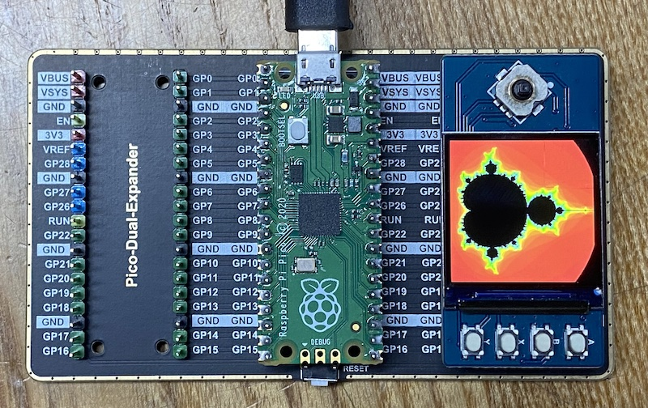
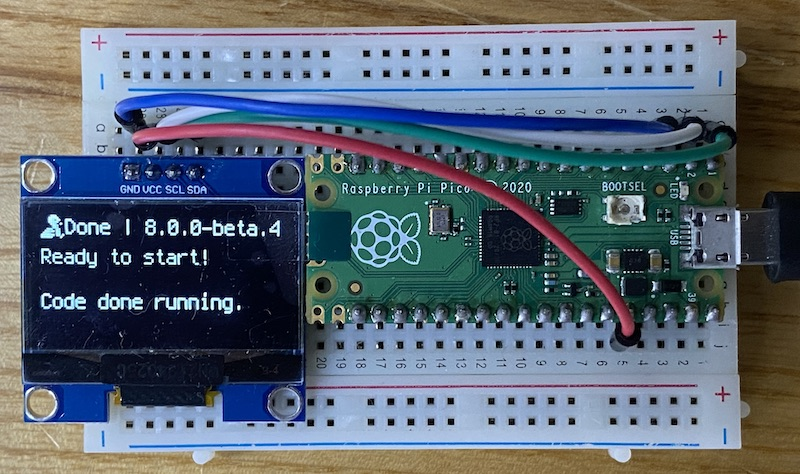

# rp2040
Example programs in CircuitPython for the Raspberry Pico 2040. We use it with 3 different external displays as more detailed optical output than just the led.

## 320x240 ili9341 3.2 inch tft

[3.2 inch display at thegioiic.com](https://www.thegioiic.com/lcd-3-2inch-320x240-tft-ili9341-giao-tiep-spi-v2-0)

## 240x240 st7789 1.3 inch waveshare tft

[1.3 tft display documentation at waveshare](https://www.waveshare.com/wiki/Pico-LCD-1.3)

| TFT   | Pico | Description                                               |
|-------|------|-----------------------------------------------------------|
| VCC   | VSYS | Power Input                                               |
| GND   | GND  | GND                                                       |
| DIN   | GP11 | MOSI pin of SPI, slave device data input                  |
| CLK   | GP10 | SCK pin of SPI, clock pin                                 |
| CS    | GP9  | Chip selection of SPI, low active                         |
| DC    | GP8  | Data/Command control pin (High for data; Low for command) |
| RST   | GP12 | Reset pin, low active                                     |
| BL    | GP13 | Backlight control                                         |
| A     | GP15 | User button A                                             |
| B     | GP17 | User button B                                             |
| X     | GP19 | User button X                                             |
| Y     | GP21 | User buttonY                                              |
| UP    | GP2  | Joystick-up                                               |
| DOWN  | GP18 | Joystick-down                                             |
| LEFT  | GP16 | Joystick-left                                             |
| RIGHT | GP20 | Joystick-right                                            |
| CTRL  | GP3  | Joystick-center                                           |

## 128x64 sh1106 1.3 inch oled

[1.3 inch oled at thegioiic.com](https://www.thegioiic.com/lcd-oled-1-3inch-128x64-chu-xanh-duong-4-chan-giao-tiep-iic)

## 128x32 ssd1306 oled adafruit

[Adafruit documentation circuitpython]()

# rp2040 and i2c sensors

We would like to just solder a 4-pin JST XH 2.54 mm pitch (0.1 ") connector to any of these boards and then use a standard XH-4 cable to connect to our ssis:bit without worrying about polarity or correct pin order:

The order of pins in the 1mm QUIIC connector is different from the order of the 4 pins found in virtually every hobby board with 2.54mm pins:

Hopefully we soon have a little shelf with all these different sensors for 'plug and play' and a software library on our boards.
