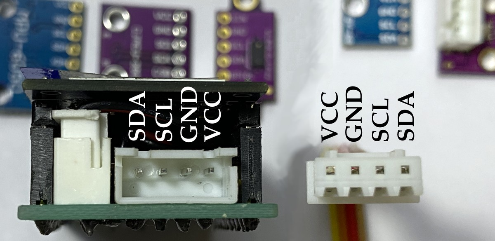

# Base for rp2040 with power supply, 2 buttons, display and male/female headers

In order to have an autonomous microcontroller system we created a 3D-printed base to support the additional features for an independent data collection and control system solution. The final product looks like this:

It took several iterations until it was finished and had the i2c connector included:

