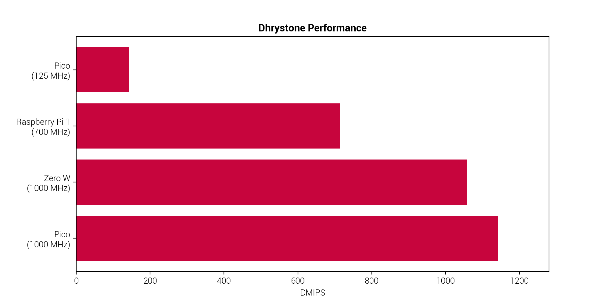

# Overclocking the Raspberry Pico rp2040 - released 2021

It can reach more than 1 GHz and be faster than the original Raspberry Pi 1 from 2012 with BCM2835 ([ARM11](https://en.wikipedia.org/wiki/ARM11) 32bit ARMv6) stock 700 MHz and even faster than the Zero W from 2017 with the same SoC at 1 GHz:



## 2022-08-22 Story on raspberrypi.com: 1 GHz

Liz Upton reports on the experiments done by David Bell in this blog post: [Don’t try this at home: overclocking RP2040 to 1GHz](https://www.raspberrypi.com/news/dont-try-this-at-home-overclocking-rp2040-to-1ghz/).

- Scripts on Github: [https://github.com/davidb990/rp2040_xoc](https://github.com/davidb990/rp2040_xoc)
- [Dhrystone benchmark](https://en.wikipedia.org/wiki/Dhrystone) adapted: [XOC dhry](https://github.com/davidb990/rp2040_xoc/tree/main/XOC_dhry)
- Adapted from [Roy Longbottom](http://www.roylongbottom.org.uk/) for Pico SDK

## 2023-03-18 How to Overclock and Underclock a Raspberry Pi Pico - MicroPython and CircuitPython

On tomshardware.com there is an [article by Les Pounder](https://www.tomshardware.com/how-to/overclock-raspberry-pi-pico) to to get to 270 MHz with MicroPython. 

``` py
import machine
machine.freq()
machine.freq(270000000)
```

Test run to automatically determine maximum speed:

``` py
import machine
import time
freq = 270000000
speed = str(round(machine.freq()/1000000,1))
print("The starting speed is",speed,"MHz")
print("Starting the test in five seconds")
time.sleep(5)
while True:
   machine.freq(freq)
   speed = str(round(machine.freq()/1000000,1))
   print("The current speed is",speed,"MHz")
   freq += 10000000
time.sleep(2)
```

### CircuitPython

I tested my cheap Chinese version and could easily achieve 400 MHz, but that's probably I'm not using any SPRAM. The code is similar to MicroPython:

``` py
import microcontroller
microcontroller.cpu.frequency
microcontroller.cpu.frequency = 400000000
```

## 2024-08-31 RP2350 at 600 MHz

Story on the [forum of raspberrypi.com](https://forums.raspberrypi.com/viewtopic.php?t=375975). 

There is a [Gist by Michael Bell](https://gist.github.com/MichaelBell/c413356f4c45bf9aef98cd23ceb83057) from December 2024 to adjust the voltage as well and get an overclock in MicroPython.

Part of this project was also to [update CoreMark for the rp2350](https://github.com/MichaelBell/CoreMark-RP2040) (originally [for the rp2040](https://github.com/protik09/CoreMark-RP2040) by [Protik Banerji](https://github.com/protik09) in March 2021.
